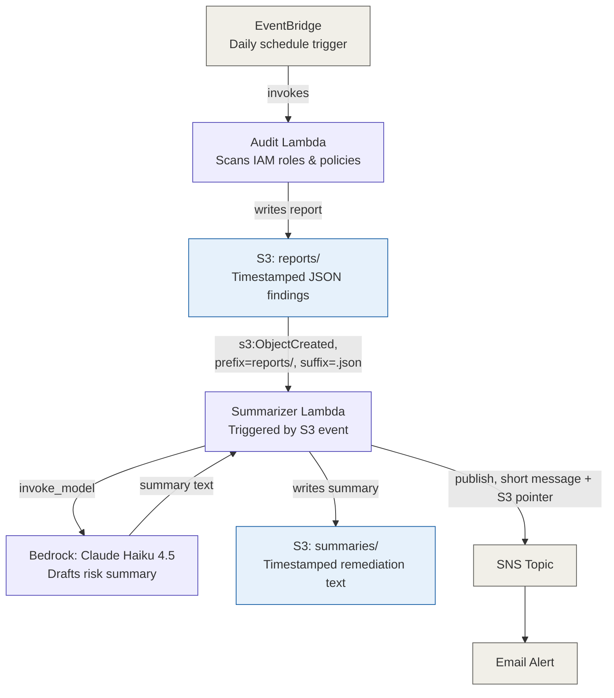

# Rebuild Guide — Build This Project From Scratch

This document contains everything needed to rebuild the IAM Compliance Auditor from an empty AWS account, using only the final, correct, working version of every file. It exists so anyone — including a future version of the original author — can clone this repo and reproduce it exactly, without re-discovering the bugs that were debugged along the way.

If you just want to *run* the project, see the main [README.md](./README.md). This file is for rebuilding it step by step, understanding why each piece exists, and seeing the exact final code for every file.

---

## Architecture



**How to read this:** two Lambda functions, each with their own narrowly-scoped IAM role, connected by S3 as the shared state store. Nothing calls anything directly except EventBridge invoking the audit Lambda — every other handoff (audit → summarizer, summarizer → alert) happens through an AWS-managed event mechanism (S3 notifications, SNS), not a direct function call. This is deliberate: it means each Lambda can be tested, redeployed, and reasoned about independently.

---

## Prerequisites

- An AWS account with an IAM user that has permissions to create IAM roles/policies, Lambda functions, S3 buckets, EventBridge rules, SNS topics, and to invoke Bedrock
- [Terraform](https://developer.hashicorp.com/terraform/downloads) >= 1.5
- [AWS CLI](https://docs.aws.amazon.com/cli/latest/userguide/getting-started-install.html), configured via `aws configure`
- Python 3.12 (matches the Lambda runtime used)
- A real email address you can access, for SNS alerts

---

## Step 1 — Project scaffolding

```bash
mkdir -p iam-compliance-auditor/terraform iam-compliance-auditor/lambda/audit iam-compliance-auditor/lambda/summarizer
cd iam-compliance-auditor
git init
```

Confirm your AWS credentials work before writing any Terraform:

```bash
aws sts get-caller-identity
```

Create a `.gitignore` at the project root:

```
*.tfstate
*.tfstate.backup
.terraform/
.terraform.lock.hcl
*.pyc
__pycache__/
.env
*.zip
```

---

## Step 2 — Foundation: S3 bucket + first IAM role

### `terraform/variables.tf`

```hcl
variable "aws_region" {
  description = "AWS region to deploy into"
  type        = string
  default     = "us-east-1"
}

variable "project_name" {
  description = "Project name used for resource naming"
  type        = string
  default     = "iam-compliance-auditor"
}
```

### `terraform/main.tf`

```hcl
terraform {
  required_version = "~>1.15.6"
  required_providers {
    aws = {
      source  = "hashicorp/aws"
      version = "~>6.0"
    }
    archive = {
      source  = "hashicorp/archive"
      version = "~> 2.4"
    }
  }
}

provider "aws" {
  region = var.aws_region
}

data "aws_caller_identity" "current" {}

resource "aws_s3_bucket" "bucket" {
  bucket = "${var.project_name}-${data.aws_caller_identity.current.account_id}"
}

resource "aws_s3_bucket_versioning" "versioning" {
  bucket = aws_s3_bucket.bucket.id
  versioning_configuration {
    status = "Enabled"
  }
}

resource "aws_s3_bucket_public_access_block" "block" {
  bucket                  = aws_s3_bucket.bucket.id
  block_public_acls       = true
  block_public_policy     = true
  ignore_public_acls      = true
  restrict_public_buckets = true
}
```

**Why the bucket name includes the account ID:** S3 bucket names are globally unique across every AWS account on Earth, not just yours — a plain name like `iam-findings` will very likely collide with someone else's bucket.

Run:
```bash
cd terraform
terraform init
terraform plan
terraform apply
```

---

## Step 3 — The audit Lambda (detection logic)

This is pure Python, tested locally first, deployed later in Step 4.

### `lambda/audit/handler.py`

```python
import logging
import json
import os
import hashlib
from datetime import datetime, timezone

import boto3

logger = logging.getLogger()
logger.setLevel(logging.INFO)

iam = boto3.client("iam")
s3 = boto3.client("s3")

_policy_document_cache: dict[str, dict] = {}

FINDINGS_BUCKET = os.environ.get("FINDINGS_BUCKET_NAME")


def _as_list(value):
    """
    Normalize a field so it is always returned as a list.
    IAM policy fields like Statement, Action, or Resource can appear
    either as a single object/string or as a list.
    """
    if value is None:
        return []
    return value if isinstance(value, list) else [value]


def find_wildcard_violations(policy_document: dict) -> list[dict]:
    """
    Return statements that grant wildcard action AND wildcard resource
    on an Allow effect. Deny statements are never flagged -- a broad
    Deny is a safety guardrail, not a risk.
    """
    violations = []
    statements = _as_list(policy_document.get("Statement", []))

    for statement in statements:
        effect = statement.get("Effect")
        actions = _as_list(statement.get("Action", []))
        resources = _as_list(statement.get("Resource", []))

        is_wildcard_violation = (
            effect == "Allow"
            and "*" in actions
            and "*" in resources
        )

        if is_wildcard_violation:
            violations.append({
                "Sid": statement.get("Sid", "NO_SID"),
                "Action": actions,
                "Resource": resources,
                "Effect": effect,
            })

    return violations


def get_all_roles() -> list[dict]:
    """Fetch all IAM roles in the account. Handles pagination."""
    roles = []
    paginator = iam.get_paginator("list_roles")

    for page in paginator.paginate():
        for role in page.get("Roles", []):
            roles.append({
                "RoleName": role["RoleName"],
                "Arn": role["Arn"],
            })

    return roles


def get_attached_policies_for_role(role_name: str) -> list[dict]:
    """Return managed policies attached to one role (names + ARNs only)."""
    policies = []
    paginator = iam.get_paginator("list_attached_role_policies")

    for page in paginator.paginate(RoleName=role_name):
        for policy in page.get("AttachedPolicies", []):
            policies.append({
                "PolicyName": policy["PolicyName"],
                "PolicyArn": policy["PolicyArn"],
            })

    return policies


def get_policy_document(policy_arn: str) -> dict:
    """
    Return the JSON document for a managed policy ARN.
    Cached so the same policy is never fetched twice in one run,
    even if many roles share it (e.g. AdministratorAccess).
    """
    if policy_arn in _policy_document_cache:
        return _policy_document_cache[policy_arn]

    policy_meta = iam.get_policy(PolicyArn=policy_arn)
    version_id = policy_meta["Policy"]["DefaultVersionId"]

    version = iam.get_policy_version(
        PolicyArn=policy_arn,
        VersionId=version_id,
    )
    document = version["PolicyVersion"]["Document"]

    _policy_document_cache[policy_arn] = document
    return document


def get_inline_policies_for_role(role_name: str) -> list[dict]:
    """Return inline policies on a role, including their documents."""
    policies = []
    paginator = iam.get_paginator("list_role_policies")

    for page in paginator.paginate(RoleName=role_name):
        for policy_name in page.get("PolicyNames", []):
            result = iam.get_role_policy(
                RoleName=role_name,
                PolicyName=policy_name,
            )
            policies.append({
                "PolicyName": policy_name,
                "Document": result["PolicyDocument"],
            })

    return policies


def _make_finding_id(role_arn: str, policy_name: str, sid: str) -> str:
    """
    Deterministic ID: same role + policy + statement always hashes
    the same, so the same violation is trackable across runs.
    """
    raw = f"{role_arn}|{policy_name}|{sid}"
    return hashlib.sha256(raw.encode("utf-8")).hexdigest()[:16]


def audit_role(role: dict, audit_timestamp: str) -> list[dict]:
    """Run all checks for one role, returning fully-structured findings."""
    findings = []
    role_name = role["RoleName"]
    role_arn = role["Arn"]

    for attached in get_attached_policies_for_role(role_name):
        document = get_policy_document(attached["PolicyArn"])
        for v in find_wildcard_violations(document):
            findings.append({
                "finding_id": _make_finding_id(role_arn, attached["PolicyName"], v["Sid"]),
                "role_name": role_name,
                "role_arn": role_arn,
                "policy_name": attached["PolicyName"],
                "policy_type": "attached",
                "statement_sid": v["Sid"],
                "effect": v["Effect"],
                "action": v["Action"],
                "resource": v["Resource"],
                "severity": "CRITICAL",
                "audit_timestamp": audit_timestamp,
            })

    for inline in get_inline_policies_for_role(role_name):
        for v in find_wildcard_violations(inline["Document"]):
            findings.append({
                "finding_id": _make_finding_id(role_arn, inline["PolicyName"], v["Sid"]),
                "role_name": role_name,
                "role_arn": role_arn,
                "policy_name": inline["PolicyName"],
                "policy_type": "inline",
                "statement_sid": v["Sid"],
                "effect": v["Effect"],
                "action": v["Action"],
                "resource": v["Resource"],
                "severity": "CRITICAL",
                "audit_timestamp": audit_timestamp,
            })

    return findings


def run_audit() -> dict:
    """Discover every role, check every role's policies, collect findings."""
    audit_timestamp = datetime.now(timezone.utc).isoformat()
    roles = get_all_roles()
    logger.info("Discovered %d IAM roles", len(roles))

    all_findings = []
    for role in roles:
        all_findings.extend(audit_role(role, audit_timestamp))

    logger.info("Audit complete: %d findings across %d roles", len(all_findings), len(roles))

    return {
        "audit_timestamp": audit_timestamp,
        "roles_scanned": len(roles),
        "finding_count": len(all_findings),
        "findings": all_findings,
    }


def write_report_to_s3(report: dict) -> str:
    """Write the audit report to S3 as a timestamped JSON object."""
    if not FINDINGS_BUCKET:
        raise RuntimeError(
            "FINDINGS_BUCKET_NAME environment variable is not set."
        )

    safe_ts = report["audit_timestamp"].replace(":", "-")
    key = f"reports/{safe_ts}.json"

    s3.put_object(
        Bucket=FINDINGS_BUCKET,
        Key=key,
        Body=json.dumps(report, indent=2),
        ContentType="application/json",
    )

    logger.info("Report written to s3://%s/%s", FINDINGS_BUCKET, key)
    return key


def lambda_handler(event, context):
    """Lambda entry point. Runs the full audit and writes the report to S3."""
    report = run_audit()
    s3_key = write_report_to_s3(report)

    return {
        "finding_count": report["finding_count"],
        "roles_scanned": report["roles_scanned"],
        "s3_key": s3_key,
    }


if __name__ == "__main__":
    report = run_audit()
    print(json.dumps(report, indent=2))

    fake_bad_policy = {
        "Version": "2012-10-17",
        "Statement": [
            {"Sid": "TooBroad", "Effect": "Allow", "Action": "*", "Resource": "*"}
        ]
    }
    print("\nFake bad policy test (should show 1 violation):")
    print(json.dumps(find_wildcard_violations(fake_bad_policy), indent=2))
```

**Test locally** (uses your own broad AWS credentials, not the Lambda's role):
```bash
export FINDINGS_BUCKET_NAME="iam-compliance-auditor-<your-account-id>"
cd lambda/audit
python3 handler.py
```

---

## Step 4 — Deploy the audit Lambda + its IAM role

### `terraform/iam.tf` (audit role portion)

```hcl
resource "aws_iam_role" "audit_lambda" {
  name = "${var.project_name}-audit-lambda-role"

  assume_role_policy = jsonencode({
    Version = "2012-10-17"
    Statement = [{
      Action = "sts:AssumeRole"
      Effect = "Allow"
      Principal = {
        Service = "lambda.amazonaws.com"
      }
    }]
  })
}

resource "aws_iam_role_policy" "audit_lambda_policy" {
  name = "${var.project_name}-audit-lambda-policy"
  role = aws_iam_role.audit_lambda.id

  policy = jsonencode({
    Version = "2012-10-17"
    Statement = [
      {
        Sid    = "ReadIAMForAudit"
        Effect = "Allow"
        Action = [
          "iam:ListRoles",
          "iam:ListPolicies",
          "iam:ListAttachedRolePolicies",
          "iam:ListRolePolicies",
          "iam:GetRolePolicy",
          "iam:GetRole",
          "iam:GetPolicy",
          "iam:GetPolicyVersion"
        ]
        Resource = "*"
      },
      {
        Sid      = "WriteFindingsToS3"
        Effect   = "Allow"
        Action   = ["s3:PutObject"]
        Resource = "${aws_s3_bucket.bucket.arn}/*"
      },
      {
        Sid    = "WriteLogs"
        Effect = "Allow"
        Action = [
          "logs:CreateLogGroup",
          "logs:CreateLogStream",
          "logs:PutLogEvents"
        ]
        Resource = "arn:aws:logs:*:*:*"
      }
    ]
  })
}
```

> **Gotcha:** `iam:GetRolePolicy` (fetch one inline policy's document) is easy to confuse with `iam:ListRolePolicies` (list inline policy *names* only). Missing `GetRolePolicy` produces `AccessDenied` the moment the audit Lambda tries to read an inline policy's contents — this only surfaces once running under the Lambda's own narrow role, not your broader personal credentials.

### `terraform/lambda.tf` (audit Lambda portion)

```hcl
data "archive_file" "audit_lambda_zip" {
  type        = "zip"
  source_file = "../lambda/audit/handler.py"
  output_path = "${path.module}/audit_lambda.zip"
}

resource "aws_lambda_function" "audit_lambda" {
  function_name    = "${var.project_name}-audit-lambda"
  role             = aws_iam_role.audit_lambda.arn
  handler          = "handler.lambda_handler"
  runtime          = "python3.12"
  timeout          = 30
  filename         = data.archive_file.audit_lambda_zip.output_path
  source_code_hash = data.archive_file.audit_lambda_zip.output_base64sha256

  environment {
    variables = {
      FINDINGS_BUCKET_NAME = aws_s3_bucket.bucket.bucket
    }
  }
}
```

**Note:** `boto3` doesn't need bundling — it's built into every AWS Lambda Python runtime. This is why `archive_file` only needs to zip `handler.py` itself.

Deploy and test:
```bash
terraform apply
aws lambda invoke --function-name iam-compliance-auditor-audit-lambda response.json
cat response.json
```

---

## Step 5 — The summarizer Lambda (Bedrock + AI interpretation)

### `lambda/summarizer/handler.py` (final version, including every fix)

```python
import json
import os
import time
from urllib.parse import unquote_plus

import boto3

s3 = boto3.client("s3")
bedrock = boto3.client("bedrock-runtime")
sns = boto3.client("sns")

MODEL_ID = "us.anthropic.claude-haiku-4-5-20251001-v1:0"
SNS_TOPIC_ARN = os.environ.get("SNS_TOPIC_ARN")


def get_report_from_s3(bucket: str, key: str, retries: int = 3, delay: float = 1.0) -> dict:
    """
    Fetch and parse an audit report JSON object from S3.
    Retries briefly to handle rare read-after-write timing races
    when triggered immediately by an S3 event notification.
    """
    for attempt in range(retries):
        try:
            response = s3.get_object(Bucket=bucket, Key=key)
            body = response["Body"].read().decode("utf-8")
            return json.loads(body)
        except s3.exceptions.NoSuchKey:
            if attempt == retries - 1:
                raise
            time.sleep(delay)


def summarize_findings(findings: list[dict]) -> str:
    """
    Send audit findings to Claude via Bedrock and return a
    plain-English risk summary with remediation suggestions.
    """
    prompt = (
        "You are a cloud security analyst. Given the following IAM "
        "audit findings (JSON), write a concise risk summary and "
        "specific remediation steps for each finding.\n\n"
        f"{json.dumps(findings, indent=2)}"
    )

    response = bedrock.invoke_model(
        modelId=MODEL_ID,
        body=json.dumps({
            "anthropic_version": "bedrock-2023-05-31",
            "max_tokens": 1000,
            "messages": [{"role": "user", "content": prompt}],
        }),
    )

    result = json.loads(response["body"].read())
    return result["content"][0]["text"]


def write_summary_to_s3(summary: str, bucket: str, audit_timestamp: str) -> str:
    """Write the AI-generated summary to S3, keyed by the same timestamp as the report."""
    safe_ts = audit_timestamp.replace(":", "-")
    key = f"summaries/{safe_ts}.txt"

    s3.put_object(
        Bucket=bucket,
        Key=key,
        Body=summary,
        ContentType="text/plain",
    )

    return key


def publish_alert(bucket: str, summary_key: str, finding_count: int) -> None:
    """
    Publish a short alert to SNS pointing at the full summary in S3,
    rather than dumping the full report into the notification itself.
    Alerting is for triage; S3 is for doing the actual work.
    """
    if not SNS_TOPIC_ARN:
        return  # allows local/manual testing without SNS configured

    message = (
        f"IAM Compliance Audit: {finding_count} finding(s) detected.\n"
        f"Full summary: s3://{bucket}/{summary_key}"
    )

    sns.publish(
        TopicArn=SNS_TOPIC_ARN,
        Subject="IAM Compliance Audit Results",
        Message=message,
    )


def lambda_handler(event, context):
    """
    Lambda entry point. Supports two trigger shapes:
    - Manual/test invoke: {"bucket": ..., "key": ...}
    - S3 event notification: {"Records": [{"s3": {"bucket": {...}, "object": {...}}}]}
      Note: S3 event keys are URL-encoded (a literal "+" becomes a
      URL-encoded space marker), so they must be decoded with
      unquote_plus before use, or lookups fail with NoSuchKey.
    """
    if "Records" in event:
        record = event["Records"][0]["s3"]
        bucket = record["bucket"]["name"]
        key = unquote_plus(record["object"]["key"])
    else:
        bucket = event["bucket"]
        key = event["key"]

    report = get_report_from_s3(bucket, key)
    summary = summarize_findings(report["findings"])
    summary_key = write_summary_to_s3(summary, bucket, report["audit_timestamp"])
    publish_alert(bucket, summary_key, report["finding_count"])

    return {
        "finding_count": report["finding_count"],
        "summary": summary,
        "summary_s3_key": summary_key,
    }
```

**Test locally first**, using a real report key from your bucket:
```bash
cd lambda/summarizer
python3 -c "
from handler import lambda_handler
result = lambda_handler({'bucket': '<your-bucket>', 'key': 'reports/<a-real-timestamp>.json'}, None)
print(result['finding_count'], 'findings')
print(result['summary'])
"
```

> **Bedrock model access, one-time per account:** Anthropic models on Bedrock require submitting a short "use case details" form once per AWS account before first invocation. If you see `ResourceNotFoundException: Model use case details have not been submitted for this account`, go to **Bedrock console → Model catalog → select an Anthropic model → Submit use case details**. Also note: some Claude models require an **inference profile** ID (region-prefixed, e.g. `us.anthropic.claude-haiku-4-5-...`) rather than the raw model ID — invoking the base model ID directly returns `ValidationException: ...isn't supported. Retry your request with the ID or ARN of an inference profile`.

---

## Step 6 — Deploy the summarizer + full automation

This step wires everything together: EventBridge (scheduled trigger), S3 event notification (auto-chains the summarizer), and SNS (email alert).

### `terraform/iam.tf` (summarizer role — full, final version)

```hcl
resource "aws_iam_role" "summarizer_lambda" {
  name = "${var.project_name}-summarizer-lambda-role"

  assume_role_policy = jsonencode({
    Version = "2012-10-17"
    Statement = [{
      Action = "sts:AssumeRole"
      Effect = "Allow"
      Principal = {
        Service = "lambda.amazonaws.com"
      }
    }]
  })
}

resource "aws_iam_role_policy" "summarizer_lambda_policy" {
  name = "${var.project_name}-summarizer-lambda-policy"
  role = aws_iam_role.summarizer_lambda.id

  policy = jsonencode({
    Version = "2012-10-17"
    Statement = [
      {
        Sid    = "InvokeBedrockModel"
        Effect = "Allow"
        Action = ["bedrock:InvokeModel"]
        Resource = [
          "arn:aws:bedrock:${var.aws_region}:${data.aws_caller_identity.current.account_id}:inference-profile/us.anthropic.claude-haiku-4-5-20251001-v1:0",
          "arn:aws:bedrock:*::foundation-model/anthropic.claude-haiku-4-5-20251001-v1:0"
        ]
      },
      {
        Sid      = "ReadWriteS3"
        Effect   = "Allow"
        Action   = ["s3:GetObject", "s3:PutObject"]
        Resource = "${aws_s3_bucket.bucket.arn}/*"
      },
      {
        Sid      = "ListBucket"
        Effect   = "Allow"
        Action   = ["s3:ListBucket"]
        Resource = aws_s3_bucket.bucket.arn
      },
      {
        Sid      = "PublishAlerts"
        Effect   = "Allow"
        Action   = ["sns:Publish"]
        Resource = aws_sns_topic.findings_alerts.arn
      },
      {
        Sid    = "WriteLogs"
        Effect = "Allow"
        Action = [
          "logs:CreateLogGroup",
          "logs:CreateLogStream",
          "logs:PutLogEvents"
        ]
        Resource = "arn:aws:logs:*:*:*"
      }
    ]
  })
}
```

> **Gotcha — Bedrock needs TWO resource ARNs.** `bedrock:InvokeModel` on an inference profile requires permission on both the inference profile ARN *and* the underlying foundation model ARN (note the foundation model ARN has no account ID — it's an AWS-owned shared resource, not one that lives in your account). Granting only the inference profile ARN produces `AccessDeniedException` that looks like a complete permissions failure.

> **Gotcha — `s3:ListBucket` vs `s3:GetObject`.** Without `ListBucket` granted at the **bucket level** (not `/*`), S3 collapses both "object doesn't exist" and "you're not authorized to know" into the same generic `AccessDenied` — a deliberate security-through-ambiguity design in S3. `ListBucket`'s `Resource` must be the bucket ARN itself, never `/*` — it's a bucket-level action, not an object-level one.

### `terraform/sns.tf`

```hcl
resource "aws_sns_topic" "findings_alerts" {
  name = "${var.project_name}-findings-alerts"
}

resource "aws_sns_topic_subscription" "email_alert" {
  topic_arn = aws_sns_topic.findings_alerts.arn
  protocol  = "email"
  endpoint  = "YOUR_EMAIL@example.com"  # replace with your real email
}
```

After `apply`, check your inbox and click the confirmation link — the subscription stays `PendingConfirmation` until you do, and no alert will ever deliver otherwise.

### `terraform/lambda.tf` (full, final version — audit + summarizer + automation)

```hcl
data "archive_file" "audit_lambda_zip" {
  type        = "zip"
  source_file = "../lambda/audit/handler.py"
  output_path = "${path.module}/audit_lambda.zip"
}

resource "aws_lambda_function" "audit_lambda" {
  function_name    = "${var.project_name}-audit-lambda"
  role             = aws_iam_role.audit_lambda.arn
  handler          = "handler.lambda_handler"
  runtime          = "python3.12"
  timeout          = 30
  filename         = data.archive_file.audit_lambda_zip.output_path
  source_code_hash = data.archive_file.audit_lambda_zip.output_base64sha256

  environment {
    variables = {
      FINDINGS_BUCKET_NAME = aws_s3_bucket.bucket.bucket
    }
  }
}

data "archive_file" "summarizer_lambda_zip" {
  type        = "zip"
  source_file = "../lambda/summarizer/handler.py"
  output_path = "${path.module}/summarizer_lambda.zip"
}

resource "aws_lambda_function" "summarizer_lambda" {
  function_name    = "${var.project_name}-summarizer-lambda"
  role             = aws_iam_role.summarizer_lambda.arn
  handler          = "handler.lambda_handler"
  runtime          = "python3.12"
  timeout          = 30
  filename         = data.archive_file.summarizer_lambda_zip.output_path
  source_code_hash = data.archive_file.summarizer_lambda_zip.output_base64sha256

  environment {
    variables = {
      SNS_TOPIC_ARN = aws_sns_topic.findings_alerts.arn
    }
  }
}

# --- EventBridge: daily trigger for the audit Lambda ---

resource "aws_cloudwatch_event_rule" "nightly_audit" {
  name                = "${var.project_name}-nightly-audit"
  description         = "Triggers the IAM audit Lambda once per day"
  schedule_expression = "rate(1 day)"
}

resource "aws_cloudwatch_event_target" "nightly_audit_target" {
  rule      = aws_cloudwatch_event_rule.nightly_audit.name
  target_id = "audit-lambda"
  arn       = aws_lambda_function.audit_lambda.arn
}

resource "aws_lambda_permission" "allow_eventbridge_audit" {
  statement_id  = "AllowEventBridgeInvoke"
  action        = "lambda:InvokeFunction"
  function_name = aws_lambda_function.audit_lambda.function_name
  principal     = "events.amazonaws.com"
  source_arn    = aws_cloudwatch_event_rule.nightly_audit.arn
}

# --- S3 event notification: auto-trigger the summarizer on new reports ---

resource "aws_lambda_permission" "allow_s3_invoke_summarizer" {
  statement_id  = "AllowS3Invoke"
  action        = "lambda:InvokeFunction"
  function_name = aws_lambda_function.summarizer_lambda.function_name
  principal     = "s3.amazonaws.com"
  source_arn    = aws_s3_bucket.bucket.arn
}

resource "aws_s3_bucket_notification" "report_created" {
  bucket = aws_s3_bucket.bucket.id

  lambda_function {
    lambda_function_arn = aws_lambda_function.summarizer_lambda.arn
    events              = ["s3:ObjectCreated:*"]
    filter_prefix       = "reports/"
    filter_suffix       = ".json"
  }

  depends_on = [aws_lambda_permission.allow_s3_invoke_summarizer]
}
```

> **Gotcha — infinite trigger loop.** The `filter_prefix`/`filter_suffix` on the S3 notification are not optional. Without them, the summarizer writing its own `.txt` summary into the same bucket would re-trigger itself indefinitely.

> **Gotcha — S3 event keys are URL-encoded.** This is the subtlest bug in the whole project. A timestamp-based S3 key containing a literal `+` (from a UTC offset, e.g. `+00-00`) arrives in the S3 event payload URL-encoded. Using that raw encoded string directly as the `Key` in a `get_object` call fails with `NoSuchKey` every time, consistently — not a timing issue, a wrong-key issue. Fixed with `urllib.parse.unquote_plus` in `lambda_handler` (see Step 5's final code above).

> **Gotcha — read-after-write race.** Even with keys correctly matched, an S3-triggered Lambda can occasionally be invoked before a write is fully consistent from the trigger's perspective. `get_report_from_s3`'s small retry loop (3 attempts, 1 second apart) absorbs this without masking a real, persistent failure.

Deploy:
```bash
terraform apply
```

If you hit `Error: Provider produced inconsistent final plan` referencing an `environment` block — this is a known Terraform/AWS-provider quirk when a brand-new `environment` block references a value (like an SNS topic ARN) that didn't exist yet during planning. Simply re-run `terraform apply`; it resolves once the referenced resource is confirmed to exist in state.

### End-to-end test

```bash
aws lambda invoke --function-name iam-compliance-auditor-audit-lambda response.json
cat response.json

# wait ~20-30 seconds for the S3 event chain to complete

aws s3 ls s3://<your-bucket>/reports/
aws s3 ls s3://<your-bucket>/summaries/
```

A matching timestamped pair in both folders, with no manual summarizer invocation, confirms the automation works. Check your email for the alert.

---

## Step 7 — Validate the real scheduled trigger (not just manual invokes)

Manual `aws lambda invoke` proves the code works. It does not prove the **schedule** works. Come back after the `rate(1 day)` interval has elapsed and confirm a report/summary/email appeared with zero manual action:

```bash
aws s3 ls s3://<your-bucket>/reports/
aws s3 ls s3://<your-bucket>/summaries/
```

**Optional but recommended — test with a known violation.** If your account currently has zero real wildcard-policy violations, the pipeline will only ever demonstrate the empty-findings path. Create a deliberate, temporary test fixture to prove detection actually works:

```hcl
resource "aws_iam_role" "test_overprivileged" {
  name = "${var.project_name}-TEST-overprivileged-role"

  assume_role_policy = jsonencode({
    Version = "2012-10-17"
    Statement = [{
      Action = "sts:AssumeRole"
      Effect = "Allow"
      Principal = {
        Service = "lambda.amazonaws.com"
      }
    }]
  })

  tags = {
    Purpose = "Deliberate test fixture for audit Lambda - safe to destroy anytime"
  }
}

resource "aws_iam_role_policy" "test_overprivileged_policy" {
  name = "${var.project_name}-TEST-overprivileged-policy"
  role = aws_iam_role.test_overprivileged.id

  policy = jsonencode({
    Version = "2012-10-17"
    Statement = [
      {
        Sid      = "IntentionallyTooBroad"
        Effect   = "Allow"
        Action   = "*"
        Resource = "*"
      }
    ]
  })
}
```

Apply, re-run the audit, confirm `finding_count >= 1` and a real remediation summary, then remove the fixture:
```bash
terraform destroy -target=aws_iam_role_policy.test_overprivileged_policy -target=aws_iam_role.test_overprivileged
```

---

## Step 8 — Cleanup checklist

- [ ] No stray/empty S3 objects (`aws s3 ls <bucket> --recursive`)
- [ ] Dummy test fixture role removed (`aws iam get-role --role-name <project>-TEST-overprivileged-role` should return `NoSuchEntity`)
- [ ] SNS subscription confirmed, not `PendingConfirmation`
- [ ] README reflects the actual current state of the project

---

## Full teardown (optional)

`terraform destroy` alone is not quite enough — two things need manual handling first:

**1. Empty the S3 bucket completely (including versions/delete markers)** — Terraform won't delete a non-empty versioned bucket:
```bash
aws s3api delete-objects --bucket <your-bucket> \
  --delete "$(aws s3api list-object-versions --bucket <your-bucket> \
    --query '{Objects: Versions[].{Key:Key,VersionId:VersionId}}' --output json)"

aws s3api delete-objects --bucket <your-bucket> \
  --delete "$(aws s3api list-object-versions --bucket <your-bucket> \
    --query '{Objects: DeleteMarkers[].{Key:Key,VersionId:VersionId}}' --output json)"
```

**2. Run the actual destroy:**
```bash
terraform destroy
```

**3. Manually delete CloudWatch Log Groups** — these are auto-created by Lambda and were never declared as Terraform resources, so `destroy` won't touch them:
```bash
aws logs delete-log-group --log-group-name /aws/lambda/iam-compliance-auditor-audit-lambda
aws logs delete-log-group --log-group-name /aws/lambda/iam-compliance-auditor-summarizer-lambda
```

---

## Cost

At this usage level (one scheduled run/day), the whole pipeline costs close to nothing:

| Service | Monthly cost |
|---|---|
| Lambda, EventBridge, SNS | $0 (within permanent free tier at this volume) |
| S3 | ~$0 (kilobytes of storage) |
| Bedrock (Claude Haiku 4.5) | ~$0.10–$0.30 (the only real line item — no free tier, pure pay-per-token) |
